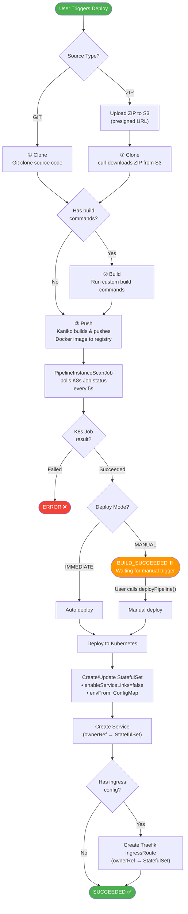
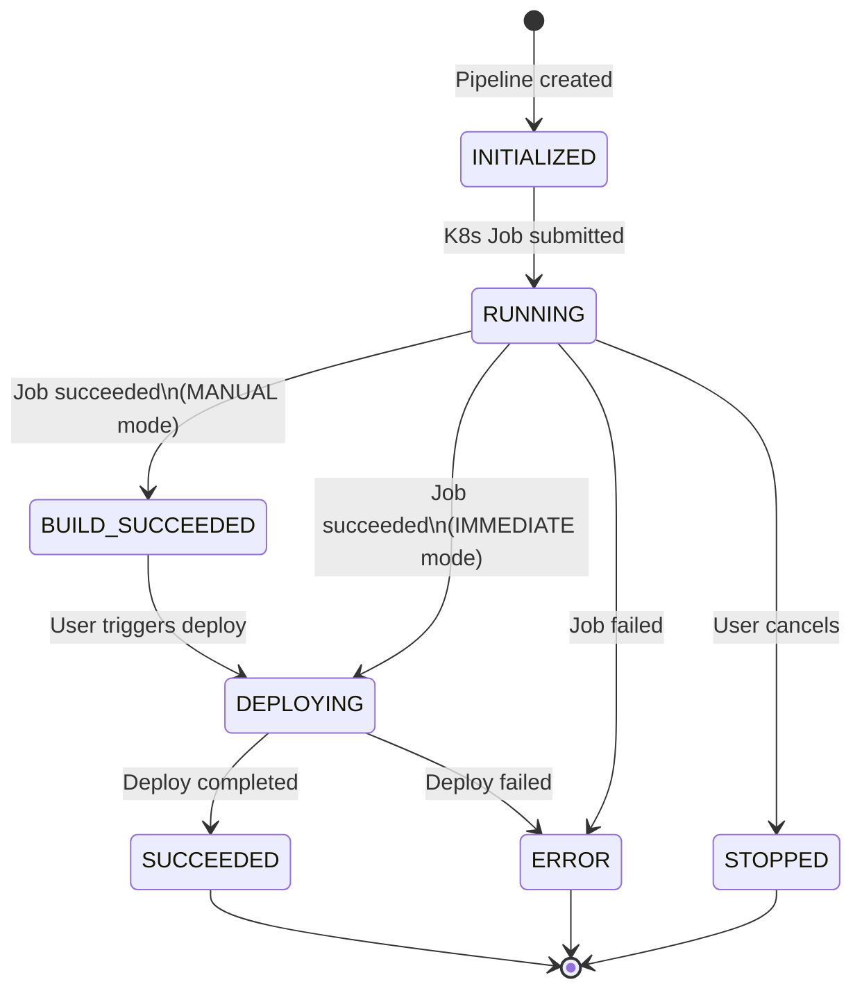

# OOPS
> Kubernetes Is All You Need

<p align="center">
  
</p>

OOPS is a lightweight Kubernetes-based PaaS (Platform as a Service) that provides a web UI for deploying and managing containerized applications across multiple clusters.

[中文](docs/README.zh.md)

## Features

### Application Management
- Deploy applications as StatefulSets with automatic service and ingress configuration
- Manage environment variables via ConfigMap injection
- Support for multiple replicas and optional resource configuration (cpu/memory requests and limits)
- Configurable HTTP health checks (liveness probe)
- Real-time pod status monitoring
- Cascade deletion of Kubernetes resources (StatefulSet, Service, IngressRoute)

### Multi-cluster Support
- Manage multiple Kubernetes clusters (Environments) from a single interface
- Per-environment API server credentials and namespace isolation
- Deploy applications to any configured cluster

### CI/CD Pipelines
- Git-based build pipelines powered by Kubernetes Jobs
- **ZIP-based deployments** with S3-compatible object storage (presigned URL upload)
- Three-stage pipeline: **clone** (shallow clone support) → **build** → **push** (Kaniko image build)
- Two deploy modes: **IMMEDIATE** (auto-deploy after build) or **MANUAL** (wait for manual trigger)
- Real-time log streaming via WebSocket
- Pipeline history and status tracking
- **Pipeline status notifications** via linked external accounts (Feishu/Lark)

### Cluster Operations
- View and monitor cluster nodes across environments

### Command Palette
- Press `/` or click the sidebar trigger to quickly search applications, deploy apps, open IDEs, or jump to pipelines
- Fast keyboard-driven navigation across namespaces

### Pod Operations
- Live pod log streaming
- In-browser terminal access (full TTY support via xterm.js)
- Pod lifecycle management

### IDE Integration (Optional)
- Browser-based code-server IDE instances as StatefulSets
- Persistent workspace volumes per developer
- Proxy domain support for IDE ingress routing
- Toggle via `oops.ide.enabled=true`

### Domain Management
- Admin-managed domains with TLS certificate configuration
- Support for auto (Traefik certResolver) and uploaded certificate modes
- Longest-suffix domain matching with wildcard support

### Authentication & Authorization
- Built-in username/password authentication with JWT
- Optional Feishu (Lark) OAuth integration
- External account linking for notification routing
- Namespace-based resource isolation
- Application ownership — users are assigned as owners of their applications

### Localization
- Four languages: Chinese (Simplified/Traditional), English, Japanese
- Language preference persisted across sessions

### Ingress
- Traefik IngressRoute CRD support for automatic HTTPS routing
- HTTP to HTTPS redirect middleware for HTTPS applications
- Gracefully skips ingress setup if Traefik CRDs are absent

## Requirements

- Kubernetes cluster
- SQLite (default) or MySQL database
- Traefik (optional, for ingress/HTTPS)

## Database Migrations

OOPS uses Flyway to apply schema and data migrations automatically during application startup.

- SQLite migrations live in `src/main/resources/db/migration/sqlite`
- MySQL migrations live in `src/main/resources/db/migration/mysql`
- Migration files must be append-only and named like `V2__add_pipeline_index.sql`
- Existing databases without Flyway history are baselined at version `1`; new databases run `V1__baseline_schema.sql`
- Hibernate DDL generation is disabled with `spring.jpa.hibernate.ddl-auto=none`

## Quick Start

1. Copy and configure `src/main/resources/application.properties.example`
2. Build and run:

```bash
# Run backend
./mvnw spring-boot:run

# Run tests
./mvnw test

# Run frontend (dev) — automatically proxies /api to localhost:8080
cd web && pnpm install && pnpm dev

# Frontend lint / build
cd web && pnpm lint
cd web && pnpm build
```

Or build the full Docker image:

```bash
docker build -t oops .
```

Default admin credentials: `admin` / `admin123` (override via `ADMIN_PASSWORD` env)

## How It Works

### Application Build & Deploy Pipeline



### Pipeline State Machine



## Snapshots


## License

This project is licensed under the Apache License 2.0. See the [LICENSE](LICENSE) file for details.
