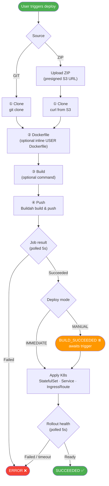
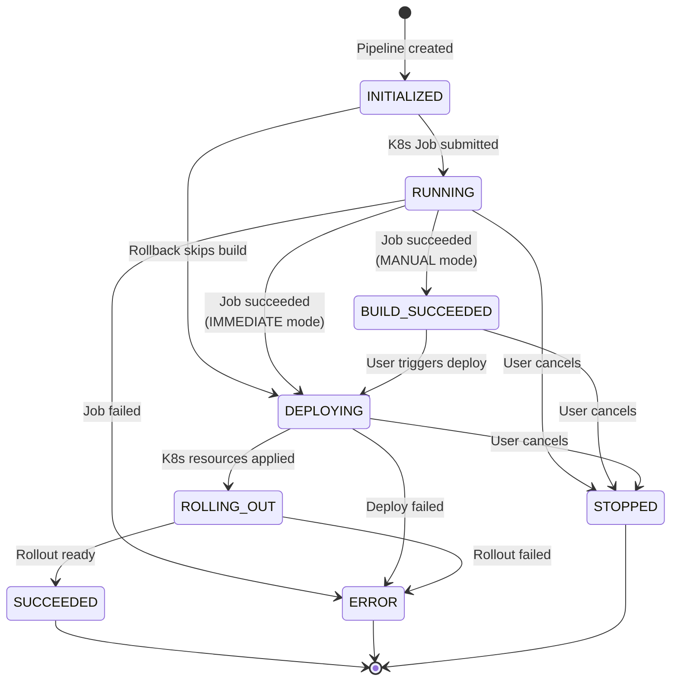

# OOPS
> Kubernetes Is All You Need


OOPS is a Kubernetes PaaS where **humans and AI Agents are equal first-class operators**. Deploy applications, manage multiple clusters, run sandboxed commands, and configure domains — all from a clean web UI, or driven programmatically through the bundled [OOPS CLI Skill](skills/oops/SKILL.md).

[中文](docs/README.zh.md)

[](https://www.react.doctor/share?p=oops&s=84&w=232&f=60)

## Why OOPS?

KubeSphere, Rainbond, and ArgoCD each solve a real slice of the Kubernetes problem — and each one assumes a **human** is the only operator. OOPS keeps the human experience intact and lets Agents drive the same platform through the same surface:

| Project | Built for | How OOPS differs |
|---|---|---|
| **KubeSphere** | Platform teams building enterprise IDPs through plug-in ecosystems | Small, focused surface — same actions usable from UI or API, no plug-in framework to navigate |
| **Rainbond** | Developers who don't want to learn Kubernetes | Same simplicity for developers, plus a programmatic surface so Agents can drive the platform too |
| **ArgoCD** | GitOps pipelines reconciling Git → cluster | Humans or Agents can deploy directly from a code archive — Git is supported but not required |

## Features

### Deploy any app
Push code or upload a ZIP, choose a repository Dockerfile or inline one, and OOPS builds the image and rolls it out to your Kubernetes cluster with build logs streaming in real time. Roll back to any previous successful build in one click — it reuses the existing image and skips the build entirely.

### Tune every deployment
Set CPU and memory requests and limits, replica count, and liveness/readiness probes per environment, and inject configuration through ConfigMaps and environment variables — without hand-writing YAML. Schedule an automatic rolling restart per environment with a simple cron picker.

### Multi-cluster management
Connect any number of clusters and manage them side by side from a single console — switch deployment targets without leaving the UI. Migrate an application to another namespace when you need to reorganize.

### Teams and access control
Invite multiple users with ADMIN or USER roles. Every application has an owner who can share access with collaborators, while destructive actions stay restricted to owners and admins.

### Watch what's running
Live logs, in-browser terminal, editable pod files, Kubernetes events, cluster nodes, rollout status, and per-pod CPU/memory usage at a glance.

### Pipeline notifications
Get build and deploy status pushed straight to chat — created, build succeeded, deploying, succeeded, failed, or stopped. Delivered to Feishu (Lark) today.

### A sandbox built for Agents
Agent-grade sandbox capability built in (similar to [OpenSandbox](https://github.com/alibaba/OpenSandbox)) — give your Agent an isolated workspace to run commands, install tools, edit files, or debug. Use one-shot streamed executions or long-lived sandbox instances with a browser terminal.

### Programmatic OpenAPI
Use per-user access tokens with the `/openapi/**` surface, or let an Agent drive the repo-vendored Python CLI in [skills/oops](skills/oops/SKILL.md). The same deployment workflow is available from the UI and automation.

### IDEs and static assets
Launch optional code-server IDE instances for applications, and manage object-storage-backed static assets from the UI.

### Multi-domain management
Manage multiple domains from a single console. Configure automatic HTTPS via certificate resolvers or upload your own TLS certificates; wildcard domains are supported.

## Requirements

| Component | Required | Purpose |
|---|---|---|
| Kubernetes cluster (1.22+) | Yes | Runtime for applications, pipelines, and IDEs |
| MySQL 8.x | Yes | Persistence for OOPS metadata |
| Container image registry | Yes | Pipeline image push / pull |
| Traefik v3 | No | Ingress and HTTPS routing |
| S3-compatible object storage | No | ZIP source uploads and static assets |

## Quick Start

```bash
cp docker/application.yml.example docker/application.yml
# edit docker/application.yml — change secrets, datasource, and any optional features
```

### Docker Compose (prebuilt images)

Pulls `ghcr.io/wellch4n/oops-backend:latest` and `ghcr.io/wellch4n/oops-frontend:latest` from GitHub Container Registry.

```bash
docker compose -f docker/docker-compose.yml up -d
```

Then open <http://localhost:8080> and sign in with `admin` / `admin123`.

### Docker Compose (build from source)

Build images locally instead of pulling from GHCR.

Bundled MySQL:

```bash
docker compose -f docker/docker-compose.build.yml up -d --build
```

Existing MySQL — edit the `spring.datasource` section in `docker/application.yml` first:

```bash
docker compose -f docker/docker-compose.local.yml up -d --build
```

### Run from source

```bash
# Backend
cp config/application.yml.example config/application.yml
./mvnw spring-boot:run

# Frontend
cd web && pnpm install && pnpm dev
```

Default admin credentials: `admin` / `admin123` (override `oops.admin.password` in `application.yml`).

## How it works

### Application Build & Deploy Pipeline



### Pipeline State Machine



## Snapshots


## License

This project is licensed under the Apache License 2.0. See the [LICENSE](LICENSE) file for details.
