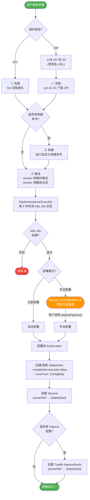
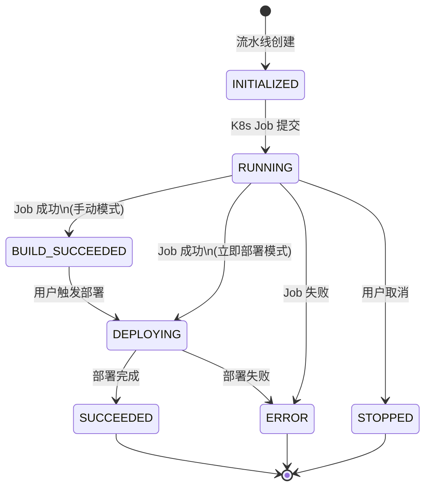
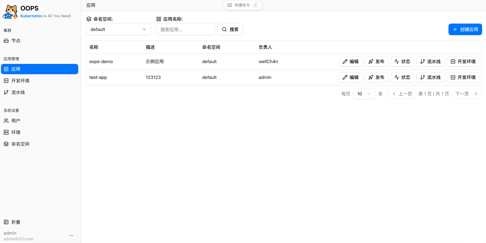
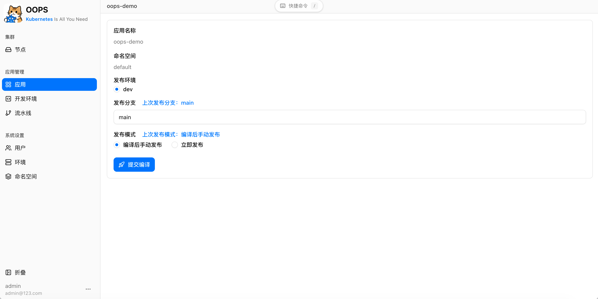
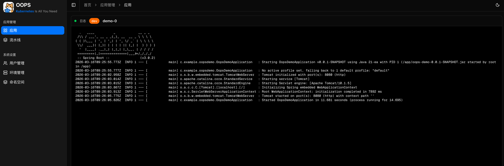
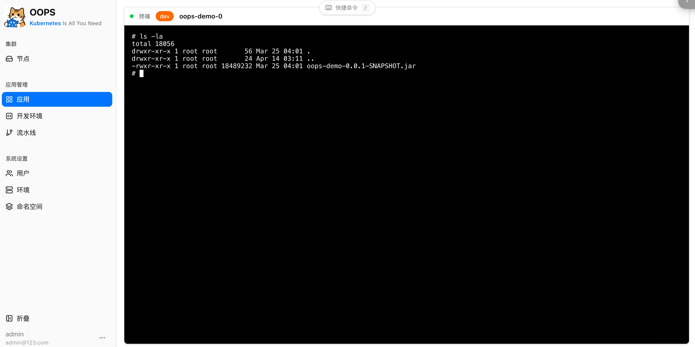
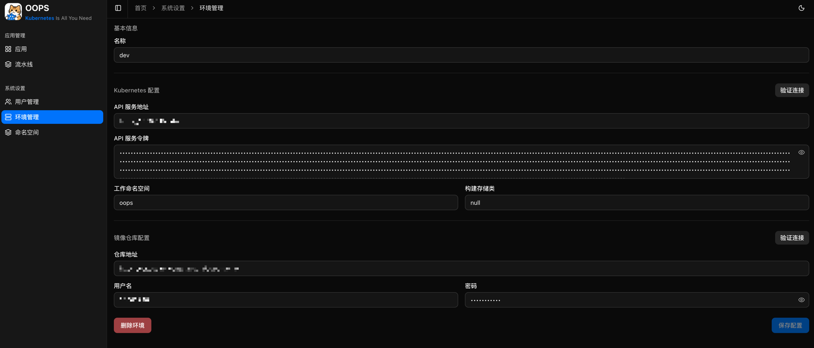
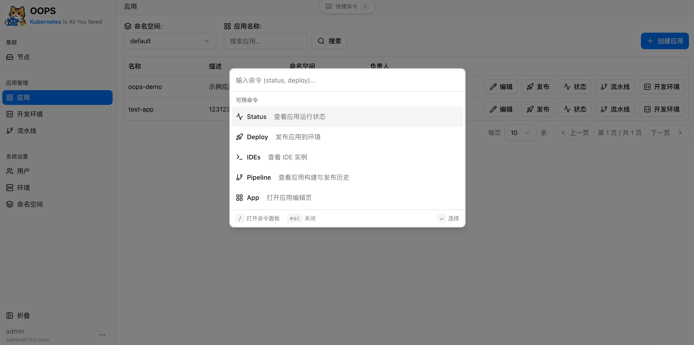
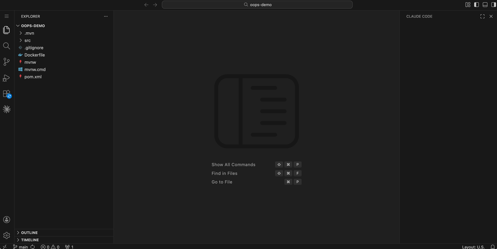

# OOPS
> Kubernetes Is All You Need


OOPS 是一个轻量级的基于 Kubernetes 的 PaaS（平台即服务），提供 Web UI 用于在多个集群中部署和管理容器化应用。

[English](../README.md)

## 功能特性

### 应用管理
- 以 StatefulSet 形式部署应用，自动配置 Service 和 Ingress
- 通过 ConfigMap 注入管理环境变量
- 支持多副本和可选的资源配置（CPU/内存 请求与限制）
- 可配置的 HTTP 健康检查（存活探针）
- 实时 Pod 状态监控
- Kubernetes 资源级联删除（StatefulSet、Service、IngressRoute）

### 多集群支持
- 通过单一界面管理多个 Kubernetes 集群（环境）
- 每个环境独立的 API Server 凭证和命名空间隔离
- 将应用部署到任意已配置的集群

### CI/CD 流水线
- 基于 Kubernetes Job 的 Git 构建流水线
- **基于 ZIP 的部署**，支持兼容 S3 的对象存储（预签名 URL 上传）
- 三阶段流水线：**克隆**（浅克隆支持）→ **构建** → **推送**（Kaniko 镜像构建）
- 两种部署模式：**立即部署**（构建完成后自动部署）或 **手动部署**（等待手动触发）
- 通过 WebSocket 实时推送日志流
- 流水线历史和状态追踪
- **流水线状态通知**，通过关联的外部账号推送（飞书/Lark）

### 集群运维
- 查看和监控各环境的集群节点

### 命令面板
- 按 `/` 或点击侧边栏触发器，快速搜索应用、部署应用、打开 IDE 或跳转到流水线
- 跨命名空间的快速键盘导航

### Pod 操作
- 实时 Pod 日志流
- 浏览器内终端访问（通过 xterm.js 完整 TTY 支持）
- Pod 生命周期管理

### IDE 集成（可选）
- 基于浏览器 code-server 的 IDE 实例，以 StatefulSet 形式运行
- 每位开发者独立的持久化工作空间卷
- 支持 IDE Ingress 路由的代理域名
- 通过 `oops.ide.enabled=true` 开启

### 域名管理
- 管理员配置的域名，支持 TLS 证书配置
- 支持自动模式（Traefik certResolver）和上传证书模式
- 最长后缀域名匹配，支持通配符

### 认证与授权
- 内置用户名/密码认证，基于 JWT
- 可选的飞书（Lark）OAuth 集成
- 外部账号关联，用于通知路由
- 基于命名空间的资源隔离
- 应用归属 — 用户被指定为其应用的负责人

### 本地化
- 四种语言：简体中文、繁体中文、英文、日文
- 语言偏好跨会话持久化

### Ingress
- 支持 Traefik IngressRoute CRD，自动 HTTPS 路由
- HTTPS 应用自动配置 HTTP→HTTPS 重定向中间件
- 如果 Traefik CRD 不存在，优雅地跳过 Ingress 配置

## 环境要求

- Kubernetes 集群
- SQLite（默认）或 MySQL 数据库
- Traefik（可选，用于 Ingress/HTTPS）

## 数据库迁移

OOPS 使用 Flyway 在应用启动时自动执行 schema 和数据迁移。

- SQLite 迁移文件位于 `src/main/resources/db/migration/sqlite`
- MySQL 迁移文件位于 `src/main/resources/db/migration/mysql`
- 迁移文件必须是追加式的，命名格式如 `V2__add_pipeline_index.sql`
- 没有 Flyway 历史记录的现有数据库会在版本 `1` 进行基线化；新数据库运行 `V1__baseline_schema.sql`
- Hibernate DDL 生成已禁用：`spring.jpa.hibernate.ddl-auto=none`

## 快速开始

1. 复制并配置 `src/main/resources/application.properties.example`
2. 构建并运行：

```bash
# 运行后端
./mvnw spring-boot:run

# 运行测试
./mvnw test

# 运行前端（开发模式）— 自动将 /api 代理到 localhost:8080
cd web && pnpm install && pnpm dev

# 前端代码检查 / 构建
cd web && pnpm lint
cd web && pnpm build
```

或直接构建完整的 Docker 镜像：

```bash
docker build -t oops .
```

默认管理员账号：`admin` / `admin123`（通过 `ADMIN_PASSWORD` 环境变量覆盖）

## 工作原理

### 应用构建与部署流水线



### 流水线状态机



## 截图















## 许可证

本项目基于 Apache License 2.0 开源。详见 [LICENSE](../LICENSE) 文件。
