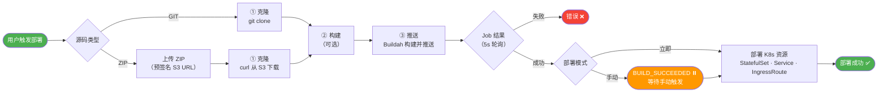
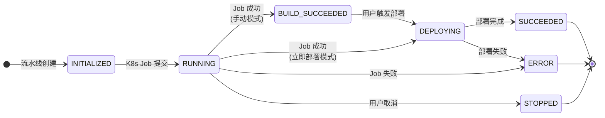

# OOPS
> Kubernetes Is All You Need


OOPS 是一个 Kubernetes PaaS，**人和 AI Agent 都是平等的操作者**。内置一个 [Claude Code Skill](../skills/oops/SKILL.md)，让 Agent 端到端完成部署——建应用、上传源码、配置构建、部署、流式日志、成功/失败推送通知——全程无需 `kubectl` 或 YAML，每个写操作都需用户显式确认，不会静默批量变更。

[English](../README.md)

[](https://www.react.doctor/share?p=oops&s=84&w=232&f=60)

## 为什么选择 OOPS？

KubeSphere、Rainbond、ArgoCD 各自解决了 Kubernetes 的一块真实问题——但它们都默认**人**是唯一的操作者。OOPS 保留完整的用户体验，同时让 Agent 也能用同一套接口操作平台：

| 项目 | 服务对象 | OOPS 的差别 |
|---|---|---|
| **KubeSphere** | 用插件生态搭建企业 IDP 的平台团队 | 接口少而聚焦——同一个动作在 UI 和 API 上都能完成，不用研究插件框架 |
| **Rainbond** | 不想学习 Kubernetes 的开发者 | 对开发者同样简单，并额外提供 API，让 Agent 也能驱动 |
| **ArgoCD** | 把 Git 和集群保持一致的 GitOps 流水线 | 人或 Agent 都能直接通过代码压缩包部署，Git 不是必须 |

## 功能特性

### 部署任意应用
推送代码或上传 ZIP，OOPS 会自动构建镜像并发布到 Kubernetes 集群，构建过程日志实时输出。

### 多集群管理
可同时接入多个集群，在同一控制台中并排管理，随时切换部署目标，无需离开界面。

### 实时观察运行状态
任何运行中的 Pod 都能看实时日志、浏览器内开终端、浏览/下载容器里的文件。集群节点和 Pod 状态一眼可见。

### 给 Agent 用的沙箱
内置 Agent 级沙箱能力（类似 [OpenSandbox](https://github.com/alibaba/OpenSandbox)）——让 Agent 在隔离环境里跑命令、装依赖、调试问题，结果实时回传，跑完即销毁，不污染应用。

### 多域名管理
在统一的控制台中管理多个域名，支持自动签发 HTTPS 证书或上传自有 TLS 证书，同时支持通配符域名。

## 环境要求

| 组件 | 是否必需 | 用途 |
|---|---|---|
| Kubernetes 集群（1.22+） | 是 | 运行应用、流水线和 IDE |
| SQLite（默认）或 MySQL | 是 | 持久化 OOPS 元数据 |
| 容器镜像仓库 | 是 | 流水线镜像推送 / 拉取 |
| Traefik v3 | 否 | Ingress 与 HTTPS 路由 |
| S3 兼容对象存储 | 否 | ZIP 源码上传 |

## 快速开始

### Docker Compose 启动

```bash
docker compose -f docker/docker-compose.yml up -d
```

打开 <http://localhost:8080>，使用 `admin` / `admin123` 登录。

### 从源码构建

```bash
# 后端
./mvnw spring-boot:run

# 前端（开发模式）— 自动将 /api 代理到 localhost:8080
cd web && pnpm install && pnpm dev
```

## 工作原理

### 应用构建与部署流水线



### 流水线状态机



## 截图


## 许可证

本项目基于 Apache License 2.0 开源。详见 [LICENSE](../LICENSE) 文件。
